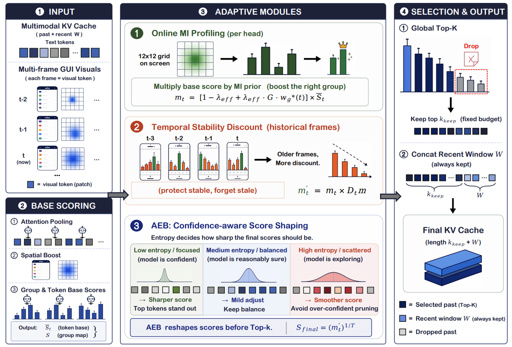

# STaR-KV

Official implementation of **STaR-KV: Spatio-Temporal Adaptive Re-weighting for KV Cache Compression in GUI Vision-Language Models**.

**Authors:** Yuhang Han, Wenzheng Yang, Yujie Chen, Xiangqi Jin, Yaojie Zhang, Siteng Huang, Linfeng Zhang

**Links:** [arXiv](https://arxiv.org/abs/2606.01790) | [PDF](https://arxiv.org/pdf/2606.01790) | [Code](https://github.com/kawhiiiileo/STaR-KV)

## Main Figure



## Overview

STaR-KV is a training-free KV-cache compression framework for GUI vision-language agents. It targets multi-frame GUI trajectories where visual KV cache grows rapidly with interaction steps.

The method re-weights KV-cache scores with three adaptive modules:

- **Online mutual-information profiling** estimates subspace-aware spatial importance for GUI visual tokens.
- **Temporal stability discount** suppresses stale or redundant historical visual tokens while preserving stable useful evidence.
- **Adaptive entropy-based score shaping** adjusts score sharpness before Top-K selection.

This repository contains the STaR-KV runtime modules and benchmark drivers for UI-TARS / Qwen2.5-VL-style models and OpenCUA-style models.

## Repository Layout

```text
.
├── starkv/                         # STaR-KV core modules
├── eval/                           # Benchmark evaluation drivers and model patching helpers
├── examples/
│   ├── repro_ssp_kv.sh             # ScreenSpot-Pro reproduction script
│   ├── starkv_local_paths.sh       # Portable path/env setup
│   └── starkv_local_paths.env.example
├── images/
│   └── main_fig.png
├── requirements.txt
└── LICENSE.txt
```

Model weights and benchmark datasets are not shipped with this repository.

## Environment Setup

The reproduction uses GPU PyTorch, FlashAttention-2, and a UI-TARS-compatible `transformers` commit.

```bash
conda create -n starkv python=3.10 -y
conda activate starkv

pip install -r requirements.txt
pip install git+https://github.com/huggingface/transformers.git@bbca9782ca1b8b358cc832a1b821aa1b450850da
pip install flash-attn --no-build-isolation
```

If PyTorch is not already installed for your CUDA version, install the proper GPU wheel first. For example:

```bash
pip install torch==2.5.1 torchvision==0.20.1 --index-url https://download.pytorch.org/whl/cu124
```

## Path Configuration

Configure model, dataset, and result roots with environment variables:

```bash
export STARKV_MODEL_DIR=/path/to/models
export STARKV_DATASETS_DIR=/path/to/datasets
export STARKV_RESULTS_DIR=/path/to/results
source examples/starkv_local_paths.sh
```

Expected default model and dataset paths after sourcing `examples/starkv_local_paths.sh`:

```text
$STARKV_MODEL_DIR/UI-TARS-1.5-7B
$STARKV_MODEL_DIR/OpenCUA-7B
$STARKV_DATASETS_DIR/ScreenSpot-Pro/images
$STARKV_DATASETS_DIR/ScreenSpot-Pro/annotations
```

For persistent local overrides, copy the example env file and edit it:

```bash
cp examples/starkv_local_paths.env.example examples/starkv_local_paths.env
```

`examples/starkv_local_paths.env` is gitignored.

## Sanity Check

Run the lightweight helper check before launching full evaluation:

```bash
conda activate starkv
source examples/starkv_local_paths.sh
PYTHONPATH="eval:starkv" python eval/attention_helpers.py
```

## Reproduce ScreenSpot-Pro Results

The provided reproduction script evaluates **UI-TARS-1.5-7B** on full **ScreenSpot-Pro** with `task=all`, `flash_attention_2`, and `bfloat16`.

```bash
source examples/starkv_local_paths.sh
GPU=0 BUDGETS="10 20" bash examples/repro_ssp_kv.sh
```

`BUDGET` / `BUDGETS` controls `--kv_cache_budget`, the retained KV-cache percentage. For example, `BUDGET=20` keeps about 20% of the full cache before appending the always-kept recent window.

The script enables the full STaR-KV stack:

```bash
--kv_cache starkv
--kv_group_soft_prior_lambda 0.5
--kv_group_online_profile_steps 5
--kv_group_online_profile_decay 0.9
--kv_group_online_profile_tau 1.0
--kv_group_online_profile_lambda_ramp_steps 10
--alpha 2
--temperature 3.5
--window_size 8
--kv_entropy_budget_enable
--kv_entropy_budget_min_scale 0.75
--kv_entropy_budget_max_scale 1.25
--kv_entropy_budget_smooth 0.0
--kv_group_temporal_enable
--kv_group_temporal_delta 0.1
--kv_group_temporal_rho 0.9
--kv_group_temporal_eps 0.0
--kv_group_temporal_discount_min 0.0
--kv_group_temporal_warmup_steps 0
```

Reference ScreenSpot-Pro accuracy with `examples/repro_ssp_kv.sh`:

| Retained KV | Overall | Text | Icon |
| --- | ---: | ---: | ---: |
| 10% | 37.57 | 52.10 | 14.07 |
| 20% | 41.18 | 55.78 | 17.55 |

Outputs are written to:

```text
$STARKV_RESULTS_DIR/repro_ssp_kv/starkv_b{budget}/screenspotpro_summary_results.json
```

## Other Benchmarks

The same STaR-KV runtime flags can be passed to the other evaluation drivers:

```text
eval/screenspotv2_eval.py
eval/androidcontrol_eval.py
eval/agentnetbench_eval.py
```

Use `--kv_cache original` for full-cache evaluation and `--kv_cache starkv` for STaR-KV compression.

## Citation

```bibtex
@misc{han2026starkv,
  title={STaR-KV: Spatio-Temporal Adaptive Re-weighting for KV Cache Compression in GUI Vision-Language Models},
  author={Han, Yuhang and Yang, Wenzheng and Chen, Yujie and Jin, Xiangqi and Zhang, Yaojie and Huang, Siteng and Zhang, Linfeng},
  year={2026},
  eprint={2606.01790},
  archivePrefix={arXiv},
  primaryClass={cs.CV},
  doi={10.48550/arXiv.2606.01790},
  url={https://arxiv.org/abs/2606.01790}
}
```

## License

See [LICENSE.txt](LICENSE.txt).
